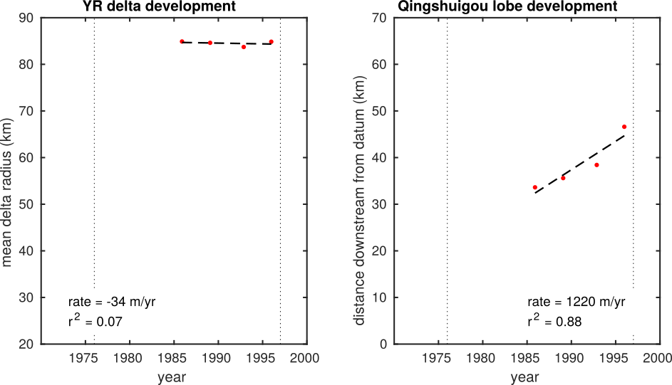

# Shoreline_extract

Matlab scripts for extracting subaerial delta shoreline from a collection of Landsat images.

Simplified demonstration version of the code used in Moodie et al. to make the shoreline traces and determine the rates of delta development of the Yellow River delta.


## Dependencies

This code was written with Matlab 2017b on Ubuntu 16.04. 
It has intentionally been written to be OS agnostic, but does depend on Matlab 2017 or newer.


## Limitations

This code was written to process Landsat images of the Yellow River delta, China.
While most of the code is agnostic of the image/location it is processing, there are some operations that are specific to the location. 

These limitations mainly occur in the context of image cropping and shoreline extraction:

* the limits of cropping are explicitly defined in the code
* a padding operation assumes land is in the lower left of the image
* some size parameters in shoreline extraction may need to be tweaked

The code will probably not work out of the box when applied to another system because of these limitations, __BUT__ with a minimal amount of work (the authors are happy to help!) it could be made to work.


## Using the program


### Obtain the source code

The code should be downloaded by cloning this repository. 
__WARNING:__ the default branch of this repository is almost 1 GB in size, because it contains 4 Landsat Level 1 products (though these have also been stripped to only necessary parts to reduce their size).

This default branch can be cloned with:

```
git clone https://github.com/amoodie/shoreline_extract.git
```

A branch of the repository without the data is also available, for a reduced file size or if you wish to use your own data with the codebase.
This version can be cloned with:

```
git clone -b no_data https://git@github.com/amoodie/shoreline_extract.git
```


### File/folder structure

A tree of the default branch, simplified for brevity, is produced below

```
.
├── data/
│   ├── LT41210341989028XXX02/
│   ├── LT51210341985329HAJ00/
│   ├── LT51210341992317HAJ00/
│   ├── LT51210341995357CLT00/
│   ├── empty.txt
│   └── qinshuigou_channelline.csv
├── output/
│   └── empty.txt
├── private/
├── source/
│   ├── build_shorelineset.m
│   └── explore_shorelineset.m
├── LICENSE.txt
└── README.md

```

The main functions live in the `source` folder.
This folder contains two files:

* `build_shorelineset.m`
* `explore_shorelineset.m`

These files make up the application, and should be run sequentially. 
The `build_shorelineset.m` file processes the raw data into a collection of data files that contain xy coordinates of the shoreline.
Then, `explore_shorelineset.m` manipulates the extracted shorelines to determine usable data from the shoreline trajectories.
After running these scripts, the `output` folder will be populated with the shoreline location and processed data.


The data used in developing the script are provided as part of this repository, but you can also obtain them (or others) for yourself from the Level 1 Landsat data at the [USGS Earth Explorer website](https://earthexplorer.usgs.gov/).
There were four scenes used to make the images and plots in this readme:

* LT51210341985329HAJ00
* LT41210341989028XXX02
* LT51210341992317HAJ00
* LT51210341995357CLT00

You can download these scenes explicitly, or any other scenes that fall into the `WRS_PATH = 121` and `WRS_ROW = 034` flight path from any time.

These files should be placed into the `data` folder _as uncompressed folders_ (see the file tree above for where the folders should be located).
Actually, the folders could be placed anywhere, if the `meta.directory` parameter in `build_shorelineset.m` is changed to the appropriate path.

The `private` folder contains the images and movies used in this documentation.


## Running the program

Once the data are properly organized into the `data` folder, you can open your Matlab GUI and navigate to and open `build_shorelineset.m`.
See the parameter list at the top of the script, and make any modifications if necessary.
Run the program.

After finishing this script, you can navigate to and open the `explore_shorelineset.m` script.
This script can be run as is, assuming you have not changes the data output location from the previous script.
This will produce a demonstration plot of the shoreline intersection routine and the resulting data from all the shorelines.




## Documentation

As of 05/09/2018, the only documentation to this program is this file.
However, the code is pretty well commented, and any changes you need to make should be pretty easy.

If there are actually people hoping to use this code, I will add more documentation support for both the program files, and potentially further split the files into function files for easier documentation.


### The shoreline extraction routine

The shoreline extraction routine is described in the supplementary material in Moodie et al.


## License

This program is licensed under the MIT license, see [LICENSE.txt](./LICENSE.txt) for the full license.


## Disclaimer and acknowledgments

This code was written by Andrew J. Moodie and Brandee Carlson as part of a National Science Foundation funded research project assessing the sustainability of anthropogenically influenced deltas.
The research is supported by Grant No. 1427262 and an NSF Graduate Research Fellowship to A.J.M. under Grant No. 1450681.
Any opinion, findings, and conclusions or recommendations expressed in this material are those of the author(s) and do not necessarily reflect the views of the National Science Foundation.
